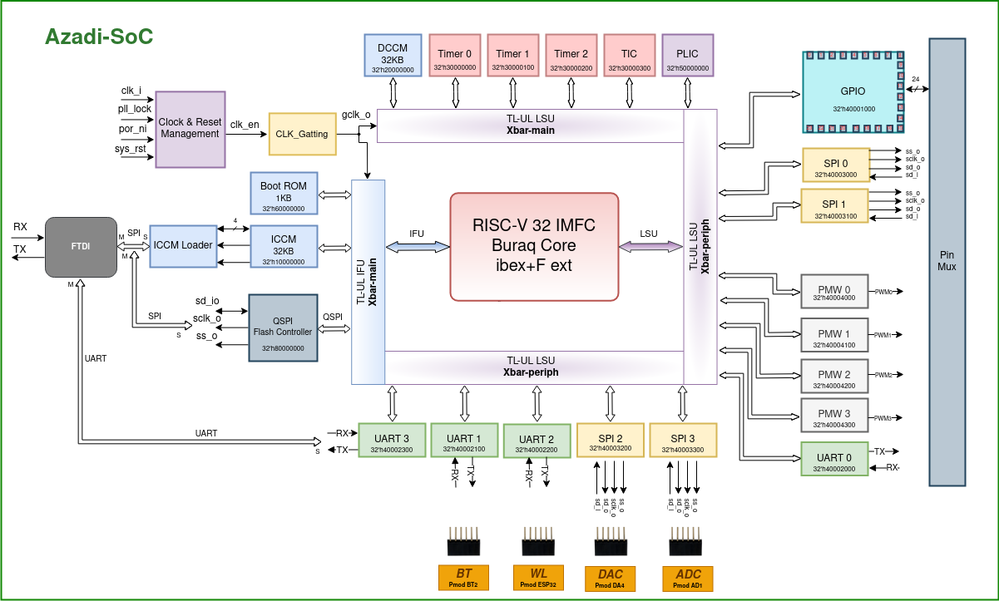

# Azadi-SoC

Azadi is an SoC with 32-bit RISC-V CPU (lowrisc/ibex + F ext), ibex is in-order core with a 3-stage pipeline that implements the RV32IMFC instruction set architecture.

## Build SoC
Clone the repo with `--recursive` flag to clone with the submodule (cvfpu)  

    git clone https://github.com/merledu/azadi-soc.git --recursive

Then, run `make` from verif folder to build the simulation for `basic-test`. To run test other than basic-test simply put `TEST=test_name` after make.

Forexample:  
  To build `fle.s` test, run 

    make TEST=fle.s

## SoC Block Diagram

## Memory Map
We are using TileLink-UL bus protocol in Azadi SoC to enable communication of CPU with peripherals. The overview of the internal cross bars are shown in the given picture.  

 The memory map table of SoC: 

|  Host           |  Peripheral           |  Base Address    |  Max Address     |  Address Space |
|:------------    |:--------------------- |:---------------- |:-----------------|:-------------- |
| Host0 (IFU)     | QSPI Flash Controller | 32'h80000000     | 32'h80FFFFFF     |    2 MBytes    |
|                 | ICCM (32KB)           | 32'h10000000     | 32'h10001FFF     |    8 KBytes    |
| Host1 (LSU)     | DCCM (32KB)           | 32'h20000000     | 32'h20001FFF     |    8 KBytes    |
|                 | Boot Register         | 32'h20002000     | 32'h20002000     |    4  Bytes    |
|                 | Timer0                | 32'h30000000     | 32'h30000FFF     |    4 KBytes    |
|                 | Timer1                | 32'h30001000     | 32'h30001FFF     |    4 KBytes    |
|                 | Timer2                | 32'h30002000     | 32'h30002FFF     |    4 KBytes    |
|                 | TIC                   | 32'h30003000     | 32'h300030FF     |   256 Bytes    |
|                 | Periph                | 32'h40000000     | 32'h4000FFFF     |   64 KBytes    |
|                 | PLIC                  | 32'h50000000     | 32'h50000FFF     |    4 KBytes    |
|                 | ROM                   | 32'h60000000     | 32'h500000FF     |  256  Bytes    |
| **Periph (Xbar-peripheral)** |          |                  |                  |                |
| LSU -> periph   | GPIO                  | 32'h40001000     | 32'h400010FF     |  256  Bytes    |
|                 | UART0                 | 32'h40002000     | 32'h400020FF     |  256  Bytes    |
|                 | UART1                 | 32'h40002100     | 32'h400021FF     |  256  Bytes    |
|                 | UART2                 | 32'h40002200     | 32'h400022FF     |  256  Bytes    |
|                 | UART3                 | 32'h40002300     | 32'h400023FF     |  256  Bytes    |
|                 | SPI0                  | 32'h40003000     | 32'h400030FF     |  256  Bytes    |
|                 | SPI1                  | 32'h40003100     | 32'h400031FF     |  256  Bytes    |
|                 | SPI2                  | 32'h40003200     | 32'h400032FF     |  256  Bytes    |
|                 | SPI3                  | 32'h40003300     | 32'h400033FF     |  256  Bytes    |
|                 | PWM0                  | 32'h40004000     | 32'h400040FF     |  256  Bytes    |
|                 | PWM1                  | 32'h40004100     | 32'h400041FF     |  256  Bytes    |
|                 | PWM2                  | 32'h40004200     | 32'h400042FF     |  256  Bytes    |
|                 | PWM3                  | 32'h40004300     | 32'h400043FF     |  256  Bytes    |

