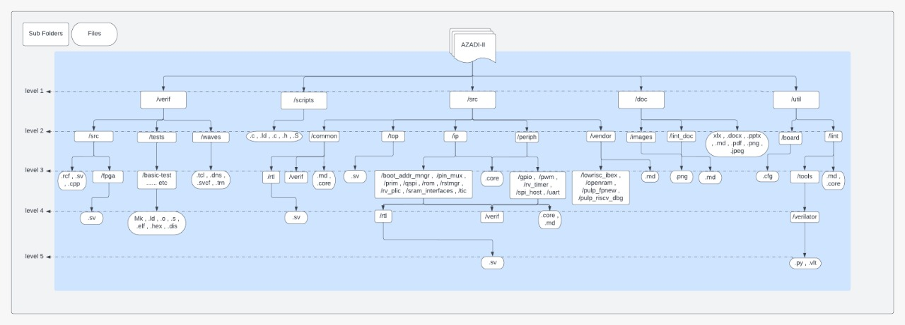
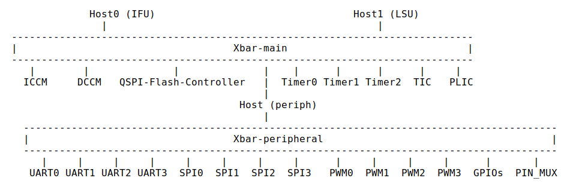

# Azadi-SoC

This repo has RTL, simulation, verification (UVM), APR files and scripts of `Azadi-SoC`.

You can find all the shared dcouments related to Azadi-SoC 65nm tapeout in this [Drive folder](https://drive.google.com/drive/folders/13rWUPcvsDv4s5yPnm0ogJ6YfQonf5DvC?usp=sharing).

## SoC Block Diagram


## Directory Structure Diagram of SoC


## Memory Map
We are using TileLink-UL bus protocol in Azadi SoC to enable communication of CPU with peripherals. The overview of the internal cross bars are shown in the given picture.



<details>
<summary> The memory map table of SoC: </summary>
<p>

|  Host           |  Peripheral           |  Base Address    |  Max Address     |  Address Space |
|:------------    |:--------------------- |:---------------- |:-----------------|:-------------- |
| Host0 (IFU)     | QSPI Flash Controller | 32'h80000000     | 32'h80FFFFFF     |    2 MBytes    |
|                 | ICCM (32KB)           | 32'h10000000     | 32'h10001FFF     |    1 KBytes    |
| Host1 (LSU)     | DCCM (32KB)           | 32'h20000000     | 32'h20001FFF     |    1 KBytes    |
|                 | Boot Register         | 32'h20002000     | 32'h20002000     |    4  Bytes    |
|                 | Timer0                | 32'h30000000     | 32'h300000FF     |   32  Bytes    |
|                 | Timer1                | 32'h30000100     | 32'h300001FF     |   32  Bytes    |
|                 | Timer2                | 32'h30000200     | 32'h300002FF     |   32  Bytes    |
|                 | TIC                   | 32'h30000300     | 32'h300003FF     |   32  Bytes    |
|                 | Periph                | 32'h40000000     | 32'h4000FFFF     |    8 KBytes    |
|                 | PLIC                  | 32'h50000000     | 32'h50000FFF     |  512  Bytes    |
|                 | ROM                   | 32'h60000000     | 32'h500000FF     |  256  Bytes    |
| **Periph (Xbar-peripheral)** |          |                  |                  |                |
| LSU -> periph   | GPIO                  | 32'h40001000     | 32'h400010FF     |   32  Bytes    |
|                 | UART0                 | 32'h40002000     | 32'h400020FF     |   32  Bytes    |
|                 | UART1                 | 32'h40002100     | 32'h400021FF     |   32  Bytes    |
|                 | UART2                 | 32'h40002200     | 32'h400022FF     |   32  Bytes    |
|                 | UART3                 | 32'h40002300     | 32'h400023FF     |   32  Bytes    |
|                 | SPI0                  | 32'h40003000     | 32'h400030FF     |   32  Bytes    |
|                 | SPI1                  | 32'h40003100     | 32'h400031FF     |   32  Bytes    |
|                 | SPI2                  | 32'h40003200     | 32'h400032FF     |   32  Bytes    |
|                 | SPI3                  | 32'h40003300     | 32'h400033FF     |   32  Bytes    |
|                 | PWM0                  | 32'h40004000     | 32'h400040FF     |   32  Bytes    |
|                 | PWM1                  | 32'h40004100     | 32'h400041FF     |   32  Bytes    |
|                 | PWM2                  | 32'h40004200     | 32'h400042FF     |   32  Bytes    |
|                 | PWM3                  | 32'h40004300     | 32'h400043FF     |   32  Bytes    |
</p>
</details>

## Simulation prerequisites
You need to have:
1. [Verilator](https://verilator.org/guide/latest/install.html) for running the simulation of the SoC.
2. [Fusesoc](https://fusesoc.readthedocs.io/en/stable/user/installation.html) for building the tools to simulate SoC.
3. [GtkWave](https://www.howtoinstall.me/ubuntu/18-04/gtkwave/) for opening the waveform file.
To achive pyhton requirements, Run:
```
cd src/vendor/lowrisc_ibex/
```
```
pip3 install -U -r python-requirements.txt
```

## Simulation guide
Clone the repositroy.
```
cd azadi-II/
```
Root directory.
```
export AZADI_ROOT=`pwd`
```
We are now ready to do our first exercises with AZADI-II. Following are the options to run the basic tests on the SoC.
1. Run simulation directly using Makefile by executing `make verilator-run` from the root and get `.vcd` file in `build/logs`.
2. Run simulation through `FuseSoc`, From root run:
```
fusesoc --cores-root=. run --target=sim merl:azadi-II:azadi_sim --cycles=519800 --timeout=8000000 --HEX=$AZADI_ROOT/verif/tests/basic-test/test.hex --ROM_BIN=$AZADI_ROOT/verif/src/post_rom_verilog.rcf
```
After simulation is done, you can find the waveform file in `$AZADI_ROOT/build/azadi_1.0/sim-verilator/logs`
