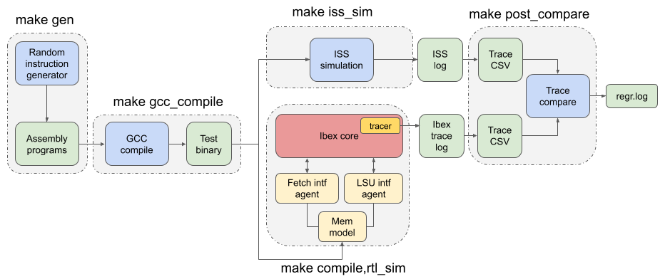

# Core DV Environment

RISCV-DV is a SV/UVM based open-source instruction generator for RISC-V processor verification. The UVM environment that comes along with Ibex repository contains self checking testing in the following manner:


(Source [here](https://ibex-core.readthedocs.io/en/latest/03_reference/verification.html))

The simulator that we used was spike. A test can be run by using the makefile.

```bash
core_ibex]$ make \
> TEST=riscv_machine_mode_rand_test \
> ITERATIONS=1 \
> SIMULATOR=xlm
```
The output folder is a ./out/seed-[seed value]/rtl_sim/[test name].[seed value] which has the following files.

1. The binary for the test
2. Log file for xcelium
3. RTL and ISS traces
4. Comparison results between two files
5. Waveforms (if given the option WAVES=1)


Adding a simple `uvm_top.print_topology();` in the `end_of_elaboration_phase` method of any test yields the following topology report in the log file for xcelium.
```log
-----------------------------------------------------------------------------
Name                            Type                              Size  Value
-----------------------------------------------------------------------------
uvm_test_top                    core_ibex_base_test               -     @2182
  env                           core_ibex_env                     -     @2821
    data_if_response_agent      ibex_mem_intf_response_agent      -     @2893
      driver                    ibex_mem_intf_response_driver     -     @3676
        rsp_port                uvm_analysis_port                 -     @3778
        seq_item_port           uvm_seq_item_pull_port            -     @3726
      monitor                   ibex_mem_intf_monitor             -     @3643
        addr_ph_port_monitor    uvm_analysis_port                 -     @4806
        item_collected_port     uvm_analysis_port                 -     @4756
      sequencer                 ibex_mem_intf_response_sequencer  -     @3809
        addr_ph_port_sequencer  uvm_tlm_analysis_fifo #(T)        -     @4456
          analysis_export       uvm_analysis_imp                  -     @4701
          get_ap                uvm_analysis_port                 -     @4651
          get_peek_export       uvm_get_peek_imp                  -     @4553
          put_ap                uvm_analysis_port                 -     @4602
          put_export            uvm_put_imp                       -     @4504
        rsp_export              uvm_analysis_export               -     @3868
        seq_item_export         uvm_seq_item_pull_imp             -     @4424
        arbitration_queue       array                             0     -    
        lock_queue              array                             0     -    
        num_last_reqs           integral                          32    'd1  
        num_last_rsps           integral                          32    'd1  
    instr_if_response_agent     ibex_mem_intf_response_agent      -     @2926
      driver                    ibex_mem_intf_response_driver    uvm_analysis_port                 -     @5812
          put_export            uvm_put_imp                       -     @5714
        rsp_export              uvm_analysis_export               -     @5083
        seq_item_export         uvm_seq_item_pull_imp             -     @5635
        arbitration_queue       array                             0     -    
        lock_queue              array                             0     -    
        num_last_reqs           integral                          32    'd1  
        num_last_rsps           integral                          32    'd1  
    irq_agent                   irq_request_agent                 -     @2957
      driver                    irq_request_driver                -     @6150
        rsp_port                uvm_analysis_port                 -     @6   uvm_analysis_port                 -     @5812
          put_export            uvm_put_imp                       -     @5714
        rsp_export              uvm_analysis_export               -     @5083
        seq_item_export         uvm_seq_item_pull_imp             -     @5635
        arbitration_queue       array                             0     -    
        lock_queue              array                             0     -    
        num_last_reqs           integral                          32    'd1  
        num_last_rsps           integral                          32    'd1  
    irq_agent                   irq_request_agent                 -     @2957
      driver                    irq_request_driver                -     @6150
        rsp_port                uvm_analysis_port                 -     @6252
        seq_item_port           uvm_seq_item_pull_port            -     @6200
      monitor                   irq_monitor                       -     @6066
        irq_port                uvm_analysis_port                 -     @6119
      sequencer                 uvm_sequencer                     -     @6283
        rsp_export              uvm_analysis_export               -     @6343
        seq_item_export         uvm_seq_item_pull_imp             -     @6899
        arbitration_queue       array                             0     -    
        lock_queue              array                             0     -    
        num_last_reqs           integral                          32    'd1  
        num_last_rsps           integral                          32    'd1  
    vseqr                       core_ibex_vseqr                   -     @2988
      rsp_export                uvm_analysis_export               -     @3048
      seq_item_export           uvm_seq_item_pull_imp             -     @3610
      arbitration_queue         array                             0     -    
      lock_queue                array                             0     -    
      num_last_reqs             integral                          32    'd1  
      num_last_rsps             integral                          32    'd1  
  irq_collected_port_test       uvm_tlm_analysis_fifo #(T)        -     @2510
    analysis_export             uvm_analysis_imp                  -     @2762
    get_ap                      uvm_analysis_port                 -     @2711
    get_peek_export             uvm_get_peek_imp                  -     @2611
    put_ap                      uvm_analysis_port                 -     @2661
    put_export                  uvm_put_imp                       -     @2559
  item_collected_port_test      uvm_tlm_analysis_fifo #(T)        -     @2031
    analysis_export             uvm_analysis_imp                  -     @2478
    get_ap                      uvm_analysis_port                 -     @2427
    get_peek_export             uvm_get_peek_imp                  -     @2327
    put_ap                      uvm_analysis_port                 -     @2377
    put_export                  uvm_put_imp                       -     @2275
-----------------------------------------------------------------------------

```
